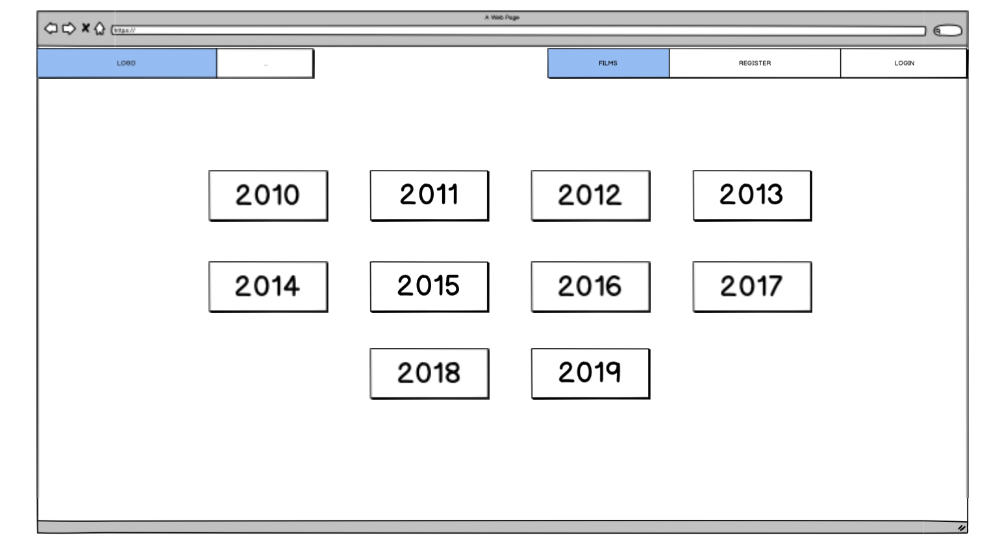
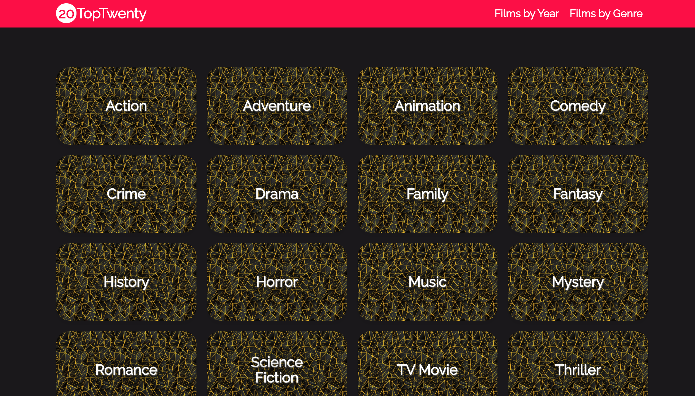
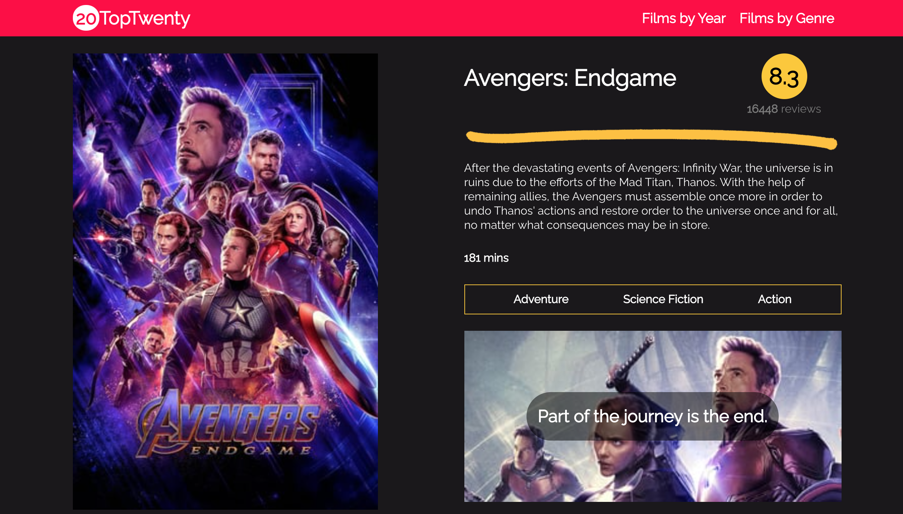

# Software Engineering Immersive: Project 2
This is the second project I completed during the General Assembly Software Engineering Immersive course (Week 6). This project was made in collaboration with Latch Jack (https://github.com/latchjack) as part of a 48-hour 'Reactathon'.

---

# TopTwenty

This project is a movie database that displays information on the top twenty most popular movies of the chosen year or genre, built using The Movie Database API (https://www.themoviedb.org/documentation/api).

## Built With

1. HTML5
2. SCSS
   * Bulma
3. JavaScript
   * ECMAScript6
   * React
   * Axios
4. GitHub

## Deployment

This project is deployed on Heroku and can be found here: https://top-twenty.herokuapp.com/

## Getting Started

Use the clone button to download the game source code. In the terminal, enter the following commands:

To install all the packages listed in the package.json:
```
$ npm i
```
Run the app on your localhost:
```
$ npm run serve
```
Check the console for any issues, and if there are any, check the package.json for any dependencies missing.

## Website Architecture

### Wireframes and User Experience

We started by designing some basic wireframes using Balsamiq, so that we could visualise what information we would have on each page and the general layout. Here is an example:



#
### Homepage

We wanted to create a simple homepage with a full width hero and website name for users to land on when they first navigate to the website. Users can then use the navbar at the top of the screen to search for films either by year or genre.


#
### Film Category Pages

We decided to create two separate film category pages, as we thought that people were most likely to search for either a specific genre of film or the latest releases. To create the year category page, we used a for loop to produce a card for every year of the last decade, so that users can choose to search for films released in a specific year.

```js
createCards = () => {
  const years = []
  for (let i = 2019; i >= 2010; i--) {
    years.push(
      <div key={i} className="column is-one-quarter-desktop is-one-third-tablet is-half-mobileyear-card">
        <Link to="/films">
          <div className="card year">
            <h4 onClick={this.handleClick} className="title has-text-white is-1">{i}</h4>
          </div>
        </Link>
      </div>
    )
  }
  return years
}
```

For the genre category page, our process had to be slightly different as the list of genres needed to reflect the different genres used by The Movie Database API. We created a function to get a list of all the genres from the API so that the page can then be populated with as many buttons as there are genres.



#
### Film Index Pages

Once a year or genre has been selected, a function runs to get the film data in the chosen category from The Movie Database API and the page displays a card for each film. We created a separate card component (FilmCard.js) to use as a template card, which is then populated with the film data passed down from the parent component (index page).


#
### Film Information Page

If you click on one of the cards on the film index page you are taken to a page displaying more information about the film. We did this by creating a function that makes a request to the API using the ID of the chosen film card so that it only returns data specifically for the relevant film.

```js
async componentDidMount() {
  const filmId = this.props.match.params.id
  try {
    const res = await axios.get(`https://api.themoviedb.org/3/movie/${filmId}?api_key=${key}`)
    this.setState({ film: res.data })
    this.getGenres()
  } catch (err) {
    console.log(err)
  }
}
```

As a film can have more than one genre, the film data returned an array of objects for the different genres. We created a function that maps each object in the array and returns only the genre name, as this is the only information we wanted to display on the page.

```js
getGenres = () => {
  const newGenres = this.state.film.genres.map(genre => {
    return genre.name
  })
  this.setState({ genres: newGenres })
}
```

The information page displays the film title, synopsis, poster image, tagline, duration, rating, number of reviews and a list of the associated genres.



## Wins and Key Learnings

- It was the first time we had used React for a project, and so it was a steep learning curve getting comfortable with updating state in order to re-render the page. It also helped us to widen our knowledge on making child and parent components communicate in React. Once we got more familiar with React, we were amazed at what we could build in just 48 hours.

- Another key learning was how useful loops and array methods can be in writing short and efficient code. For this project, we used them to produce multiple elements from one template component.

- This project really taught us the importance of research when using APIs. At first we thought that the only way to access the genre data was through each film object, but after further research into the API documenation, we found that by using a different API request we could access a full list of all genres in the database. This discovery enabled as to add the 'Films by Genre' feature.

## Challenges and Future Improvements

- As we only had 48 hours to complete the project, we did not have enough time to make the site responsive as we would have liked. We used Bulma for some of the styling, which meant that some areas of our website were mobile-friendly, but other aspects of the website could definitely be improved upon in this area.

- I would like add a watchlist feature, where users can select films they like the look of and add them to their 'to watch' list. This would involve giving users the ability to create accounts to access their own personal list films to watch.


